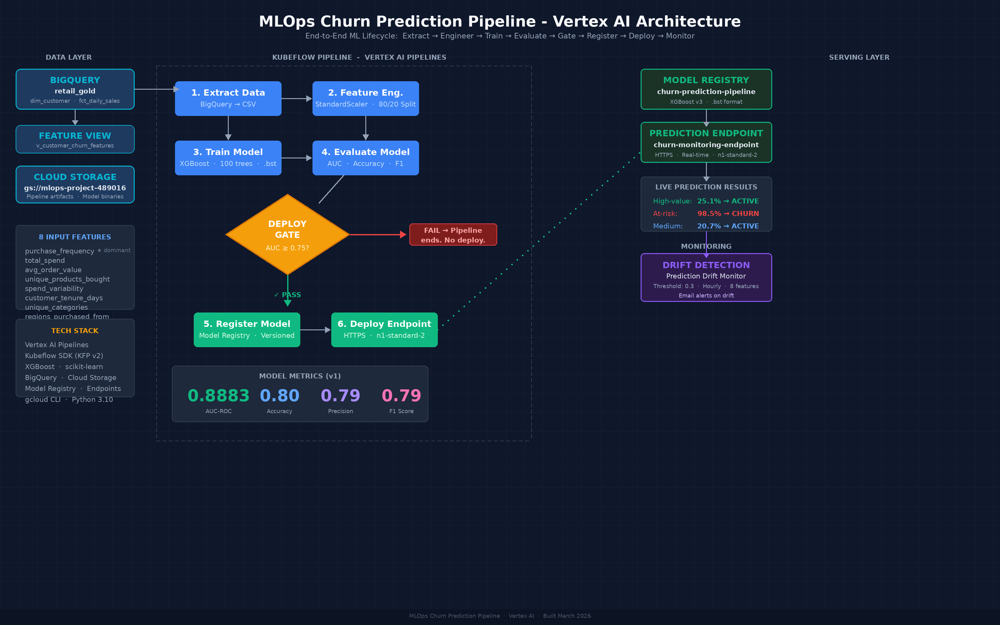
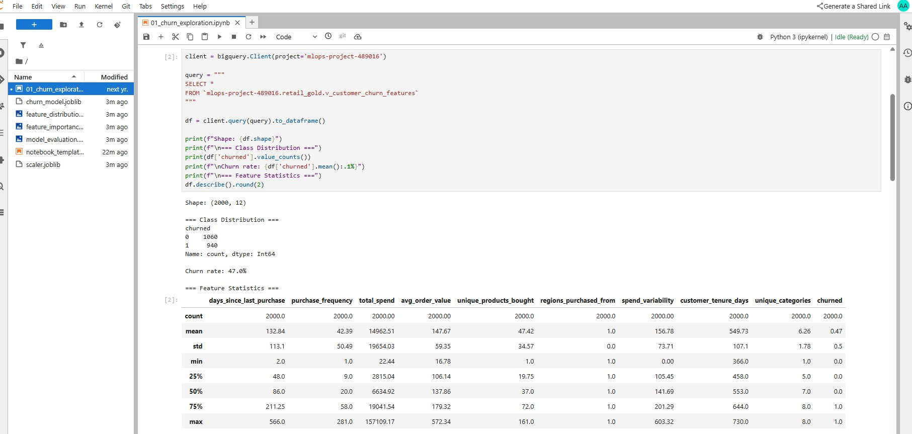
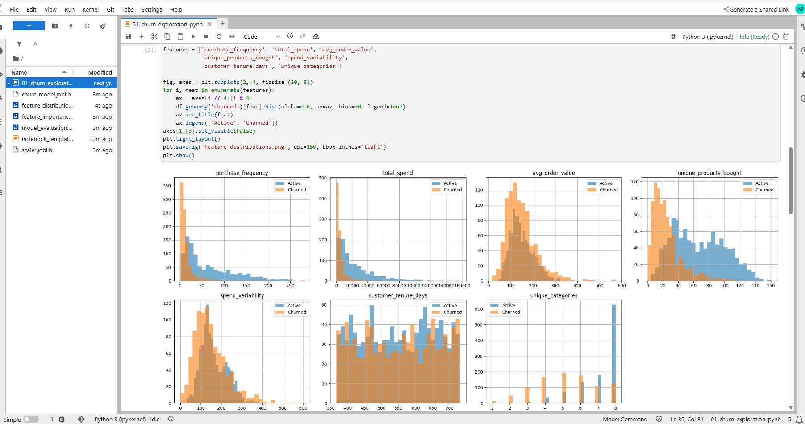
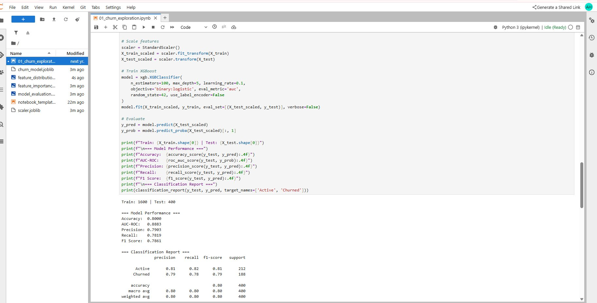
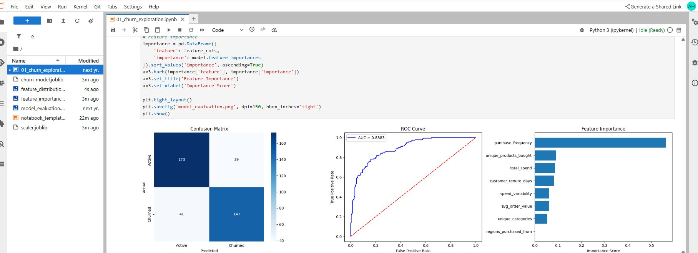
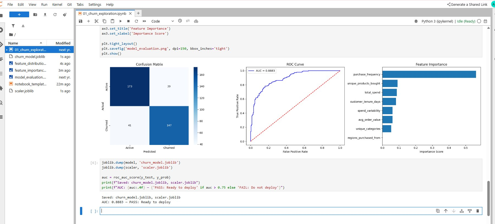
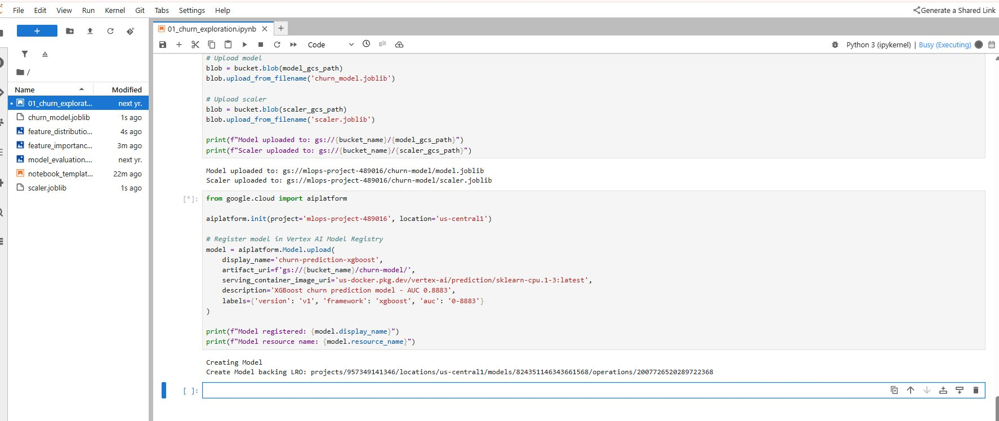
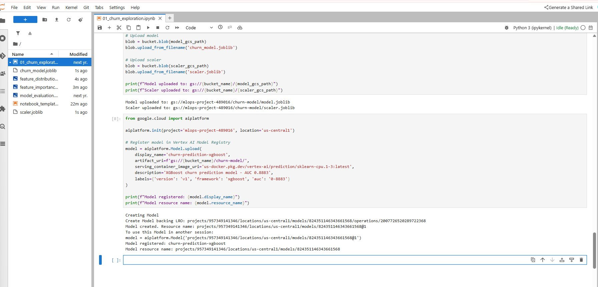
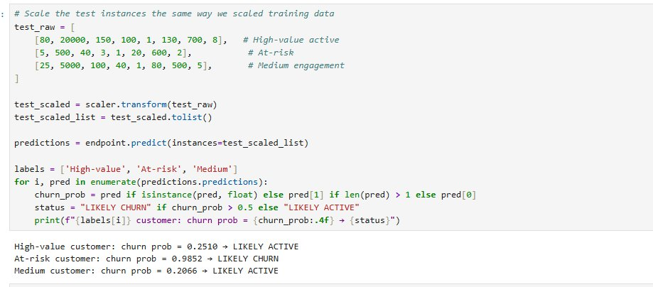
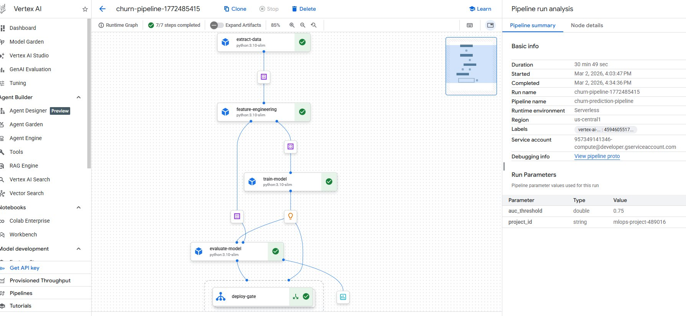

# MLOps Churn Prediction Pipeline-  Vertex AI
An end-to-end MLOps pipeline on Google Cloud Vertex AI that automates customer churn prediction from raw BigQuery data through model training, evaluation, registry, and endpoint deployment-  with conditional deployment gates, model versioning, and drift monitoring.
## Why This Project Exists
Most ML portfolio projects stop at model training in a notebook. This project goes further-  it codifies the entire ML lifecycle into a repeatable, automated Kubeflow pipeline that runs on managed infrastructure. The pipeline is the production system, not a handoff artifact.
**What it proves:** Kubeflow Pipelines orchestration, Vertex AI custom training, model versioning and registry, automated deployment gates (only deploy if AUC > 0.75), real-time endpoint serving, and data drift monitoring.
## Architecture Overview

The system follows a six-stage pipeline pattern: Extract → Engineer → Train → Evaluate → Register → Deploy, with a conditional gate between evaluation and registration that prevents underperforming models from reaching production.
**Infrastructure:** Google Cloud Platform (Vertex AI, BigQuery, Cloud Storage, Artifact Registry)
**ML Framework:** XGBoost binary classifier with StandardScaler preprocessing
**Orchestration:** Kubeflow Pipelines SDK (KFP v2) on Vertex AI Pipelines
**Data Source:** BigQuery retail dataset (2,000 customers, 201K transactions)
## Model Performance
| Metric | Value |
|--------|-------|
| AUC-ROC | 0.8883 |
| Accuracy | 0.8000 |
| Precision | 0.7903 |
| Recall | 0.7819 |
| F1 Score | 0.7861 |
The model uses 8 features derived from customer transaction history: purchase frequency, total spend, average order value, unique products bought, regions purchased from, spend variability, customer tenure, and unique categories. Purchase frequency is the dominant predictor at ~55% feature importance.
## Pipeline DAG
The pipeline executes 6 containerized components as a directed acyclic graph on Vertex AI Pipelines:
1. **Extract Data**-  Pulls customer features from BigQuery retail_gold dataset, computes RFM metrics and behavioral features
2. **Feature Engineering**-  Applies StandardScaler normalization, produces stratified 80/20 train/test split
3. **Train Model**-  Trains XGBoost classifier (100 estimators, max_depth=5, lr=0.1), saves as native .bst format
4. **Evaluate Model**-  Computes accuracy, AUC, precision, recall, F1; gates deployment at AUC ≥ 0.75
5. **Register Model**-  Uploads model artifact to Vertex AI Model Registry with version metadata (conditional)
6. **Deploy to Endpoint**-  Creates HTTPS endpoint serving real-time churn predictions (conditional)
## Screenshots
### Data Exploration and Feature Statistics

*BigQuery feature view with 2,000 customers, 47% churn rate, 12 columns including RFM metrics and behavioral features.*
### Feature Distribution Analysis

*Distribution of 7 key features segmented by churn status. Churned customers show lower purchase frequency and total spend.*
### Model Training and Performance Metrics

*XGBoost classifier results: AUC 0.8883, Accuracy 0.80, balanced precision/recall across both classes.*
### Evaluation Charts-  Confusion Matrix, ROC Curve, Feature Importance

*Left: Confusion matrix showing 173 true negatives, 147 true positives. Center: ROC curve with AUC=0.8883. Right: Feature importance with purchase_frequency as dominant predictor.*
### Model Evaluation Charts (Detail View)

*Detailed view of evaluation visualizations with feature importance breakdown.*
### Model Registry-  Upload in Progress

*Model being uploaded to Vertex AI Model Registry with version metadata and serving container configuration.*
### Model Registry-  Registration Complete

*Model successfully registered in Vertex AI Model Registry with resource name and version tracking.*
### Live Endpoint Predictions

*Real-time predictions from deployed endpoint: High-value customer (25% churn risk), At-risk customer (98.5% churn risk), Medium customer (20.7% churn risk).*
### Vertex AI Pipeline DAG-  Completed Run

*Full Kubeflow pipeline DAG on Vertex AI showing 7/7 steps completed. All components passed including the conditional deploy-gate. Duration: 30 min 49 sec.*
## Project Structure
```
mlops-churn-pipeline/
├── README.md
├── pipeline.py                    # Kubeflow pipeline definition (all 6 components + DAG)
├── generate_retail_data.py        # Synthetic data generator (2K customers, 400K transactions)
├── components/
│   ├── extract_data.py
│   ├── feature_engineering.py
│   ├── train_model.py
│   ├── evaluate_model.py
│   ├── register_model.py
│   └── deploy_model.py
├── notebooks/
│   ├── 01_churn_exploration.ipynb  # Interactive EDA + model training
│   └── 02_pipeline_build.ipynb     # Pipeline definition + submission
├──
├── docs/
│   ├── ARCHITECTURE.md
│   ├── QA_GUIDE.md                 # Interview Q&A
│   └── architecture.png            # System architecture diagram
└── screenshots/                    # Console and notebook screenshots
    ├── 01_data_exploration.png
    ├── 02_feature_distributions.png
    ├── 03_model_performance.png
    ├── 04_model_evaluation_charts.png
    ├── 05_model_evaluation_detail.png
    ├── 06_model_registry_upload.png
    ├── 07_model_registry_complete.png
    ├── 08_endpoint_predictions.png
    └── 09_pipeline_dag_complete.png
```
## Build Sequence
**Phase 1-  Data Prep + Local Model Validation (Console: Vertex AI Workbench)**
Generate synthetic retail data, load into BigQuery, create churn feature view, train XGBoost model interactively in Workbench notebook. Validate AUC > 0.75 before proceeding.
**Phase 2-  Model Registry + Endpoint (Console + Code)**
Upload trained model to GCS, register in Vertex AI Model Registry, deploy to endpoint, test real-time predictions. Undeploy after validation.
**Phase 3-  Kubeflow Pipeline (Code)**
Codify all Phase 1-2 logic into 6 Kubeflow components. Compile pipeline YAML, submit to Vertex AI Pipelines. Conditional deploy-gate only triggers registration and deployment if AUC ≥ 0.75.
**Phase 4-  Monitoring (Console + CLI)**
Deploy model to endpoint, send prediction traffic, configure model monitoring with drift detection thresholds (0.3) on all features via gcloud CLI.
**Phase 5 - Documentation**
Package code, notebooks, docs, architecture diagram, and screenshots into portfolio-ready repository.
## Technologies
Google Cloud Platform, Vertex AI Pipelines, Vertex AI Model Registry, Vertex AI Endpoints, Vertex AI Model Monitoring, BigQuery, Cloud Storage, Kubeflow Pipelines SDK (KFP v2), XGBoost, scikit-learn, Python 3.10, gcloud CLI
## Related Projects
- [enterprise-analytics](https://github.com/gbhorne/enterprise-analytics) - Enterprise data pipeline (source of retail dataset schema)
- [bigquery-ml-retail-forecasting](https://github.com/gbhorne/bigquery-ml-retail-forecasting) - BQML demand forecasting
- [adk-anomaly-detection](https://github.com/gbhorne/adk-anomaly-detection) - BQML anomaly detection
